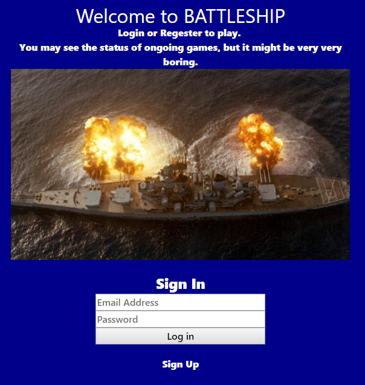
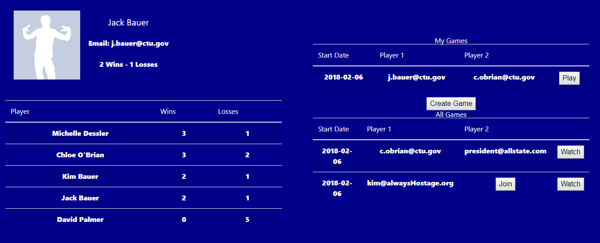
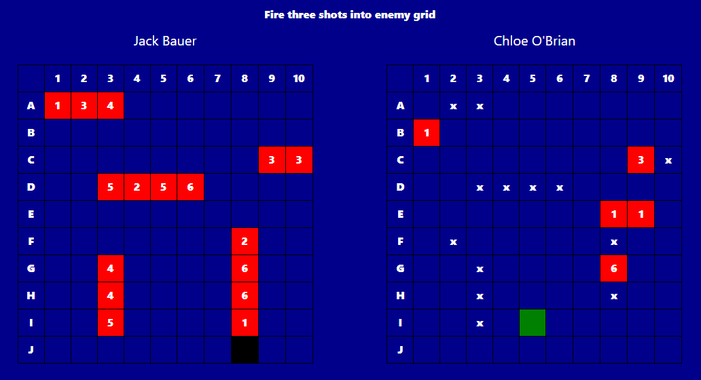

## Battleship

Classic Battleship Game hosted by Heroku

https://battlesh1p.herokuapp.com/main.html

## Technology Detail

Java Spring boot java application using Java Persistence API (JPA) for object-relational mapping using Hibernate ORM. Authentication and authorization provided by Spring Security. Multi-user access and persistent data storage using PostgreSQL.

## Access

When server is started. Data Loader Service deletes all non-persistent sample entities and reloads them for
user access.

The following is Access information for 5 Sample Users  
User Email Address: Password

j.bauer@ctu.gov: j  
c.obrian@ctu.gov: c  
kim@alwaysHostage.org: k  
president@allstate.com: d  
m.dessler@ctu.gov: m

Data Loader Service creates sample games to generate records table and ongoing games tables

## Gameplay

Sample Games can be watched or played or new users and games may be created and joined. Instructions are provided during gameplay.

## Future Development

- Front-end UI Styling adding mobile responsivity
- Migrate remaining Rest Controller functions to call Service functions following MVC architecture
- Aggregate request and response JSON objects to decrease number of requests  

## Necessary Bug fixes

- Schema issue with production PostgreSQL configuration
